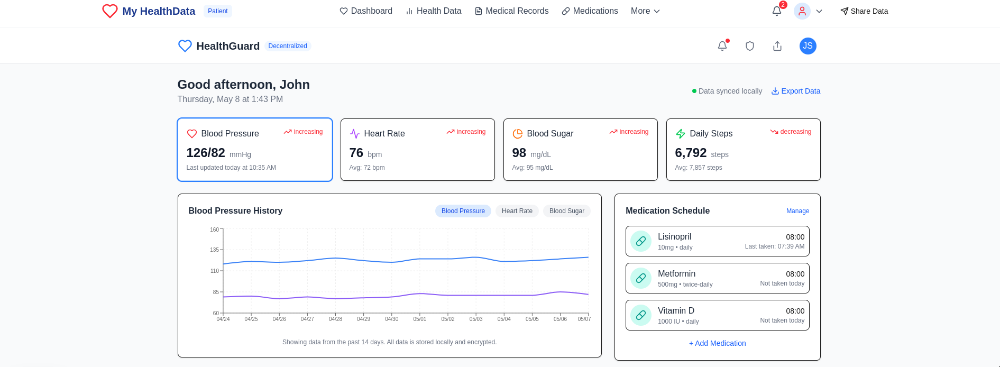

# Decentralized Healthcare Data Manager

A modern, secure platform for managing healthcare data with advanced privacy features and AI-powered insights.



## 🚀 Features

- **Secure Data Management**
  - End-to-end encryption
  - Decentralized storage
  - HIPAA compliant

- **User-Specific Portals**
  - Patient Dashboard
  - Provider Portal
  - Admin Interface

- **Advanced Analytics**
  - AI-powered health insights
  - Interactive data visualizations
  - Pattern recognition

- **Privacy Controls**
  - Granular access management
  - Audit logging
  - Privacy-first architecture

## 🛠️ Tech Stack
- Next JS
- React 18
- TypeScript
- Tailwind CSS
- Recharts for data visualization
- Lucide React for icons

## 📋 Pages & Routing

- `/` - Landing page with platform overview
- `/provider` - Healthcare provider portal
- `/dashboard` - Patient dashboard
- `/admin` - Administrative interface
- `/visualizations` - Health data visualizations
- `/medications` - Medication management
- `/data` - Data import/export center
- `/insights` - AI health insights
- `/backup` - Backup & recovery
- `/docs` - Documentation
- `/privacy` - Privacy center
- `/profile` - User profile management

## 🚦 Getting Started

1. Clone the repository:
   ```bash
   git clone https://github.com/keelann95/healthcare-manager
   ```

2. Install dependencies:
   ```bash
   cd healthcare-manager
   npm install
   ```

3. Start the development server:
   ```bash
   npm run dev
   ```

4. Open [http://localhost:5173](http://localhost:5173) in your browser

## 🔒 Security Features

- Zero-knowledge architecture
- Military-grade encryption
- Decentralized data storage
- Comprehensive audit logging
- Role-based access control

## 📱 User Interfaces

### Patient Portal
- Health metrics dashboard
- Medical history
- Appointment management
- Medication tracking
- AI-powered health insights

### Provider Interface
- Patient management
- Medical records access
- Secure messaging
- Treatment planning
- Data analytics

### Admin Dashboard
- User management
- System monitoring
- Security controls
- Audit logs
- Analytics

## 🎯 Upcoming Features

- Backend API with Node.js
- Real-time notifications
- Mobile application
- Integration with EHR systems
- Enhanced AI capabilities
- Telemedicine support

## 📖 Documentation

Comprehensive documentation is available at `/docs`, including:
- API Reference
- Security Overview
- User Guides
- Integration Instructions
- Privacy Policies

## 🤝 Contributing

We welcome contributions! Please see our [Contributing Guidelines](CONTRIBUTING.md) for details.

## 📄 License

This project is licensed under the MIT License - see the [LICENSE](LICENSE) file for details.

## 🌟 Support

For support, please open an issue in the GitHub repository or contact our support team.

---

**Note:** This is currently a frontend implementation. Backend services with Node.js are under development and will be integrated soon.